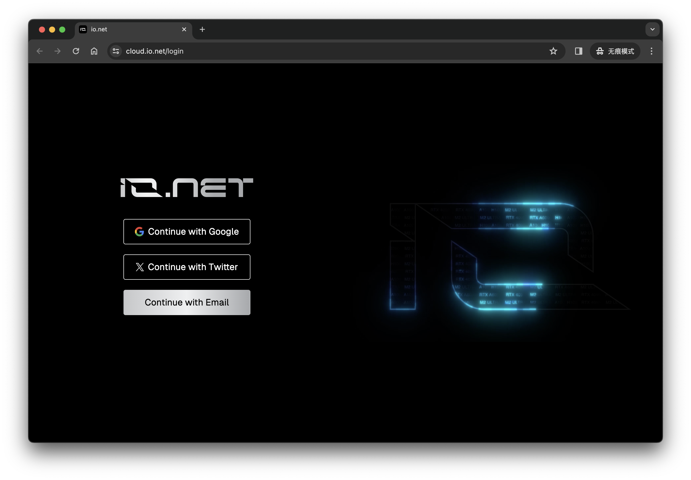
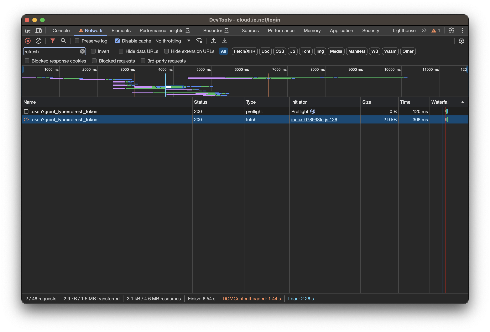
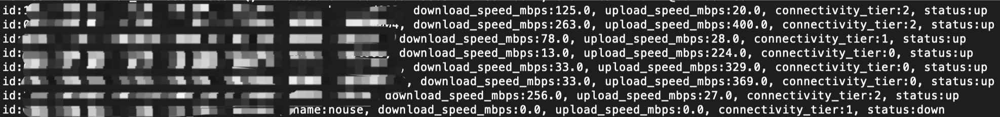

# 说明

个人在 Mac 下用来监控 ionet 设备，如果设备下线超过指定时间自动重启 Docker 容器

同时批量读取用户所有设备网速信息，针对网速不好的设备手动进行优化，如切换网络或切换VPN

*只在 Mac 下测试过，其它平台下运行可能需要修改代码*

*只适用于 Google 登录的用户，其它登录方式也需要修改代码*

# 配置

复制 config.py.sample 一份文件名为 config.py

### 配置参数说明

RefreshToken、Apikey、Authorization 三个参数需要通过 Chrome 浏览器的 DevTools 获得

方法如下：



在 ionet 登录页面点右键，选择“检查”，会显示 DevTools 页

在 DevTools 页，选择“网络”，在 filter 中输入“refresh”

继续在登录页面，选择“Google Login”，输入用户名密码，再点击“继续”

在 DevTools 中能看到 refresh_token 消息，点击后右侧选择“Response”，可以看到 refresh_token，选择右侧“Headers”，可以看到 Apikey、Authorization



IntervalMinute
间隔多少分钟检查一次

RestartMinute
如果多少分钟还是下线状态，则重启 Docker 容器，实际就是调用以下命令
```
./launch_binary_mac --device_id=xxxx --user_id=xxxx --operating_system="macOS" --usegpus=false --device_name=xxxx
```

LogLevel
日志级别，为 0 全显示，大于 0 只显示重要信息

DeviceId、UserId、DeviceName
这三个参数从 ionet 网页获得

System
系统参数：mac、linux、windows（只测试了 mac）

UseGpus
是否使用 GPU，不用显卡的如 Mac 设为 False，如果用 GPU 设为 True

# 运行

获取用户所有设备，并列出设备网速，如果发现有些设备网速不行，就需要切换网络或 VPN，尽量保证最佳网速

```
python ionet_devices.py
```



监控设备（需要将目录下文件拷贝到 ionet 的执行文件目录，运行命令调用的是同目录下程序）
```
python ionet_monitor.py
```

# 注意

一旦运行就不要在网页中再登录或刷新页面，否则会导致 Token 失效

如果 Token 失效，需要从 DevTools 中重新获取 RefreshToken

要查看所有设备状态，直接命令行下查看即可
```
python ionet_devices.py
```


